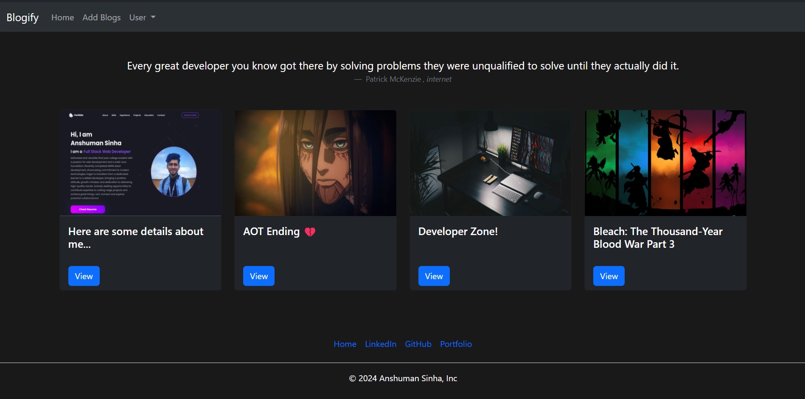

# Blogify - Your Personal Blogging Platform



Blogify is a simple and elegant blog website that allows users to create and share their thoughts through blog posts. Users can also engage with the community by commenting on other users' posts. To ensure a secure and personalized experience, Blogify implements user authentication using JWT tokens.

## Features

- **User Authentication**: Users are required to create an account to access the full functionality of Blogify. JWT tokens are used for secure authentication.

- **Create and Share Blogs**: Users can easily create, edit, and delete their blog posts. Share your thoughts and experiences with the community.

- **Commenting System**: Engage with other users by leaving comments on their blog posts. Foster a sense of community through meaningful discussions.

## Technologies Used

- **EJS**: Server-side templating engine for rendering dynamic content.
  
- **Node.js**: Server-side JavaScript runtime.

- **Express.js**: Web application framework for Node.js, used for building the server and handling HTTP requests.

- **MongoDB**: NoSQL database used for storing user data, blog posts, and comments.

- **JWT Authentication**: JSON Web Tokens are employed for secure user authentication.

## Installation

1. Clone the repository:

   ```bash
   git clone https://github.com/anshumansinha2001/Blogify.git
   ```

2. Install dependencies:

   ```bash
   npm install
   ```

3. Set up environment variables:

   Create a `.env` file in the root directory and include the following:

   ```env
   PORT=3000
   MONGODB_URI=mongodb://localhost:27017/blogify
   JWT_SECRET=yourSecretKey
   ```

   Make sure to replace `yourSecretKey` with a strong and secure secret key.

4. Run the application:

   ```bash
   npm start
   ```

   The application will be accessible at `http://localhost:3000`.

## Usage

1. Open your web browser and navigate to `http://localhost:3000`.
   
2. Register for a new account to start creating and sharing blog posts.

3. Explore existing blog posts, leave comments, and interact with the Blogify community.


## License

This project is licensed under the [MIT License](LICENSE).

---

Happy Blogging with Blogify! 📝✨
